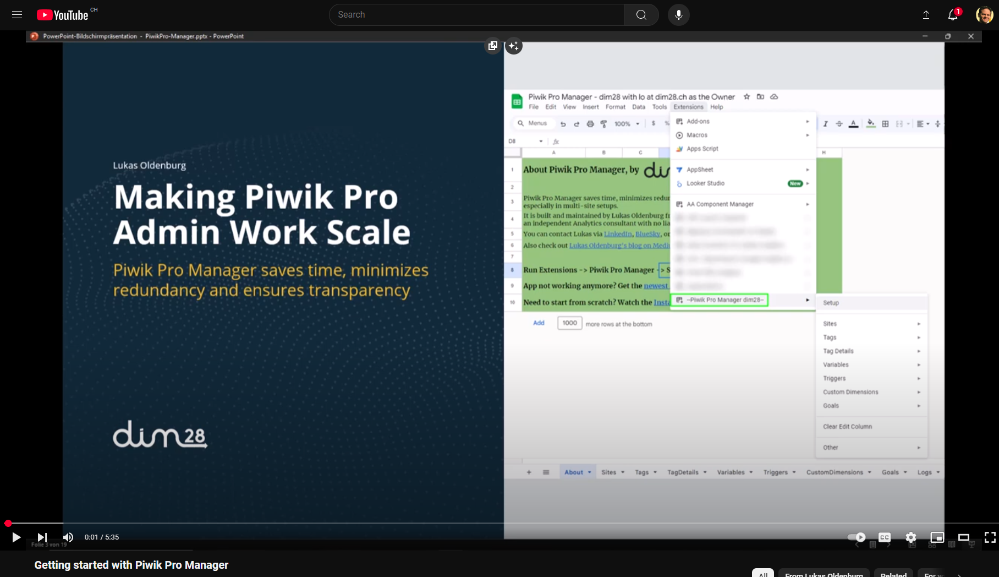
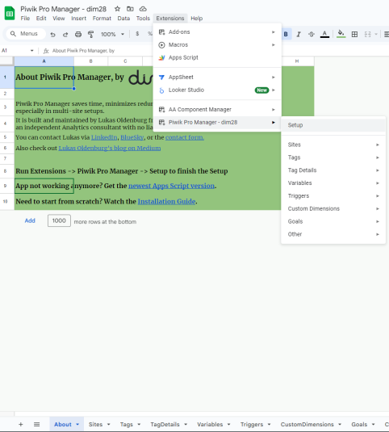
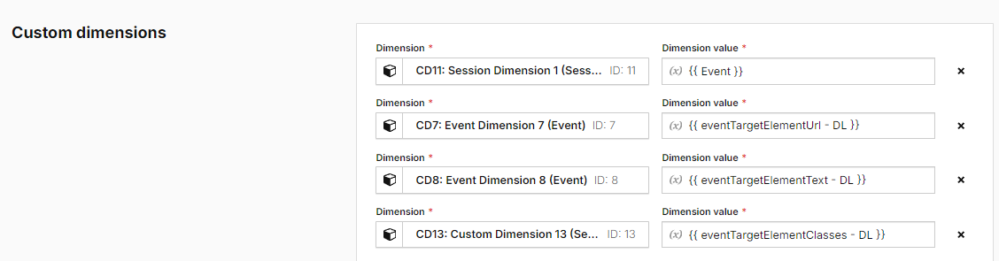
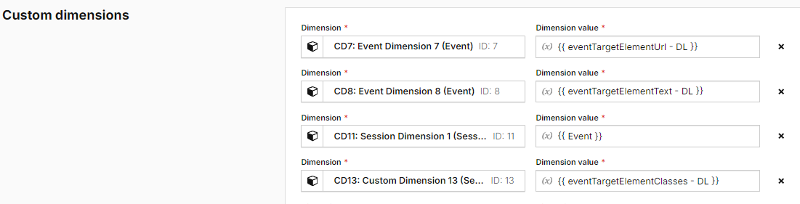

# Piwik Pro Manager
Piwik Pro Manager saves time, minimizes redundancy and fosters transparency for Piwik Pro Admins, especially in Multi-Site Setups.

## Quick Start Guide

### Video Guide

### Text Guide
1. In any Google Sheet owned by you, go to File -> Settings and ensure that the Locale is set to "United States".
2. Go to **Extensions -> Apps Script**
3. The Apps Script editor window will open.
4. Copy the code from https://github.com/loldenburg/piwik-manager-appsscript/blob/main/mainHandler.js
5. Paste the code into the Apps Script editor window.
6. Give the Apps Script a proper name (= this will be the name in your Google Sheets menu), e.g., "Piwik Pro Manager {My Org}" 
7. Save the Apps Script (e.g. via the "Save" icon).
8. Reload the Google Sheet (not the Apps Script Editor).
9. Under "Extensions", you should now see "Piwik Pro Manager {My Org}". 
10. Run "Setup" and follow the steps there.

11. After setup has completed, it populates the "Sites" tab. There, check the boxes for the Sites for which you want to view elements in Piwik Pro Manager. For example, if you select Site A and Site B, the other tabs (Tags, TagDetails, Variables, Triggers, Custom Dimensions and Goals) will only show elements from Site A and B. 

   Note that in Piwik Pro Manager, you will mostly just edit your Blueprint Site. So there is no need to select all Sites. Keep in mind that the more Sites you select, the longer it will take to refresh the tabs.  

12. Run Extensions -> Piwik Pro Manager -> Other -> Populate all Tabs. This will now populate all the tabs with the elements from the Sites you have selected in the previous step.  

## Which Piwik Pro Credentials do I need?

You need:

* A Piwik Pro Client ID and Secret for a User with "Manage" rights to the Sites you want to edit. Generate them here: https://help.piwik.pro/support/questions/generate-api-credentials/
* Your Piwik Pro Organization Prefex, e.g., if your Piwik Pro URL is "mycompany.piwik.pro", the Org Prefix is "mycompany"

## Managing Custom Dimensions in Piwik Pro Manager

* Video Guide for all important Custom Dimensions Functions: 
<iframe width="560" height="315" src="https://www.youtube.com/watch?v=f7V4xBN4X00" frameborder="0" allowfullscreen></iframe>
  ([Click here if you don't see the preview](https://www.youtube.com/watch?v=f7V4xBN4X00))
* Medium Article "Bulk-Edit & Sync Piwik Pro Custom Dimensions in multiple Sites": https://thebounce.io/bulk-edit-sync-piwik-pro-custom-dimensions-in-multiple-sites-9786d148b1ed

Having the same Custom Dimension Slots and IDs across Sites is the most crucial foundation for scalability!

The above content shows how to how to make sure you never have worry about Custom Dimensions being not in sync between Piwik Pro Sites anymore. 

Specifically, these topics are covered:

### Clone Custom Dimensions

Clones Custom Dimensions from a Blueprint Site to multiple Destination Sites. 

Menu: **Custom Dimensions -> Clone Custom Dimensions** or **Sites -> Clone Custom Dimensions**

This is great when you have created a new Site and you now want to make sure it has exactly the same Custom Dimension Setup as your existing other Site(s).

It is also useful after creating new Custom Dimension(s). You just create them in the Blueprint Site, and then run "Clone Custom Dimensions" to replicate them in any other Sites you have selected in the "Sites" tab.

### Bulk-Edit Custom Dimensions

Edits one or more Custom Dimensions marked with "edit" in the "EDIT" column on the "CustomDimensions" tab.

Menu: **Custom Dimensions -> Edit Custom Dimensions**

Editable columns are yellow. To edit, just start typing in the fields you want to edit.

### Sync Custom Dimension edits in a Blueprint Site to multiple Destination Sites

The powerful "Sync" function makes sure you never need to edit the same thing in multiple Sites anymore. 

Menu: **Custom Dimensions -> Sync Custom Dimensions** (only synchs Custom Dimensions to other Sites) or **Edit & Sync Custom Dimensions** (performs edits and then synchs them) 

**Synching** is different from **Cloning** in that **Synching keeps existing Custom Dimensions in Sync** across multiple Sites. **Cloning creates new Custom Dimensions** in other Sites.

Example: You want to edit Custom Dimension 3 and it exists in all Sites, but you don't want to do this edit in all Sites. So you simply edit the Custom Dimension(s) in your "Blueprint" Site, then select the Sites to sync to in the "SYNC IN" column, and then run the Sync. 

### Order Custom Dimensions in Tags in Piwik Pro Tag Manager by their ID

In Piwik Tag Manager, you cannot drag Custom Dimensions up or down. So if you messed up the order, this function comes to the rescue.

Menu: **Tag Details -> Order Custom Dimensions**

The function will look for all Piwik Pro Analytics-related Tags in the Sites selected in the "Sites" tab and reorder the Custom Dimensions in these Tags by their ID (so that CD1 is first, then CD2 etc...) 

The function requires the TagDetails tab to be up to date. 
So if you are not sure if it is up to date, run "Tag Details -> Update Tags & Tag Details" first.

**Example:**

Before, the tag's Custom Dimensions order is pure chaos:

After running "Order Custom Dimensions", they are nicely ordered by their ID:

## About

Piwik Pro Manager was built and is maintained by Lukas Oldenburg from dim28, an independent Analytics consultant with no liaison to the company Piwik Pro.

You can contact Lukas via [LinkedIn](https://www.linkedin.com/in/lukas-oldenburg/), [BlueSky](https://bsky.app/profile/lukasoldenburg.bsky.social), or the [contact form](https://www.dim28.ch/contact).

Also check out [Lukas Oldenburg's blog on Medium](https://lukas-oldenburg.medium.com/).

The tool is free of any warranty. It runs on Google Cloud Platform servers in Switzerland. 

Thank you for reporting any bugs. :)