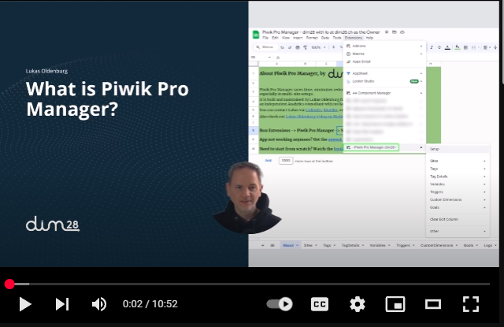
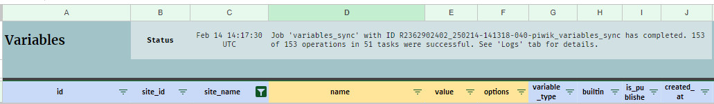
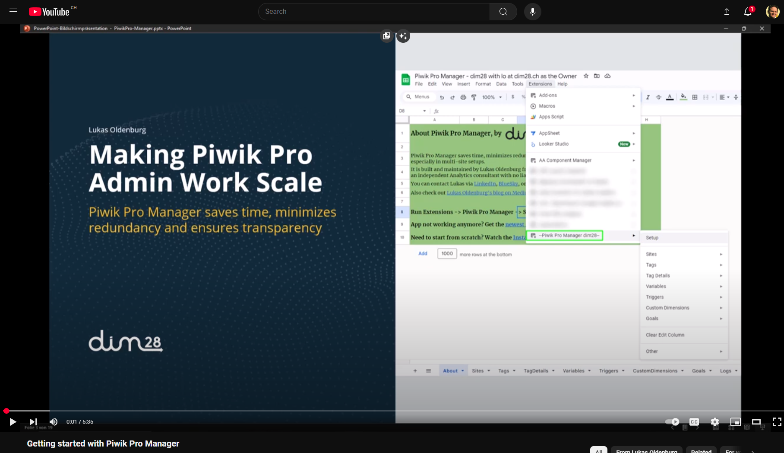
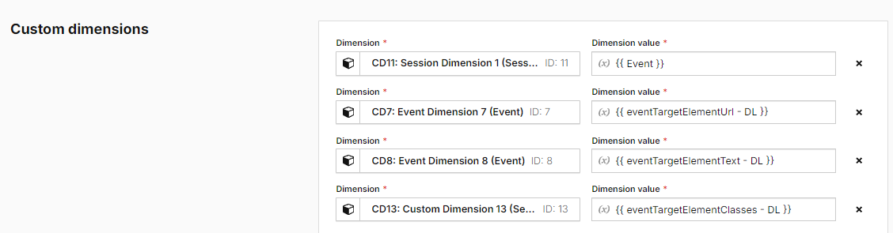
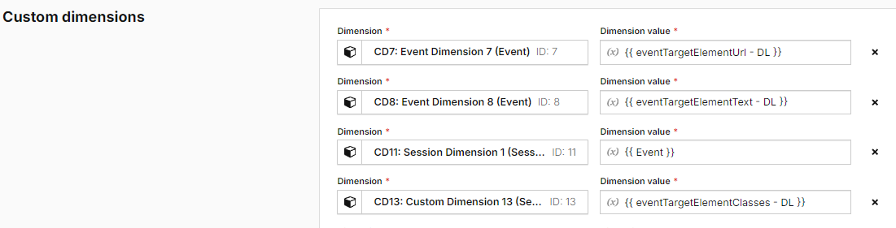
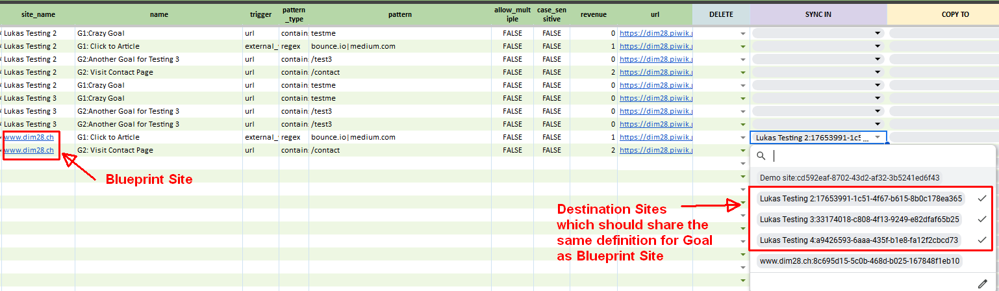

_**[---> Skip to the Quick Start Guide](#quick-start-guide)**_

<!-- TOC start (generated with https://github.com/derlin/bitdowntoc) -->

- [What is Piwik Pro Manager?](#what-is-piwik-pro-manager)
   * [YouTube Video](#youtube-video)
   * [Overview of Main Features](#overview-of-main-features)
      + [Component Types supported by PP Manager:](#component-types-supported-by-pp-manager)
      + [Some Features](#some-features)
- [Quick Start Guide](#quick-start-guide)
   * [Video Guide](#video-guide)
   * [Text Guide](#text-guide)
- [Which Piwik Pro Credentials do I need?](#which-piwik-pro-credentials-do-i-need)
- [Good things to know before you start:](#good-things-to-know-before-you-start)
- [Tag-Manager-related Functions](#tag-manager-related-functions)
- [Managing Custom Dimensions in Piwik Pro Manager](#managing-custom-dimensions-in-piwik-pro-manager)
   * [Clone Custom Dimensions](#clone-custom-dimensions)
   * [Bulk-Edit Custom Dimensions](#bulk-edit-custom-dimensions)
   * [Sync Custom Dimension edits in a Blueprint Site to multiple Destination Sites](#sync-custom-dimension-edits-in-a-blueprint-site-to-multiple-destination-sites)
   * [Order Custom Dimensions in Tags in Piwik Pro Tag Manager by their ID](#order-custom-dimensions-in-tags-in-piwik-pro-tag-manager-by-their-id)
- [Managing Goals in Piwik Pro Manager](#managing-goals-in-piwik-pro-manager)
   * [Copy Goals](#copy-goals)
   * [Edit & Sync Goals](#edit-sync-goals)
   * [Deleting Goals](#deleting-goals)
- [Piwik Pro Manager Config Settings](#piwik-pro-manager-config-settings)
- [Piwik Pro Manager vs. Piwik Pro Meta Sites](#piwik-pro-manager-vs-piwik-pro-meta-sites)
   * [Meta Sites in Tag Manager](#meta-sites-in-tag-manager)
   * [Meta Sites in Analytics](#meta-sites-in-analytics)
- [About](#about)

<!-- TOC end -->

<!-- TOC -->
# What is Piwik Pro Manager?

Piwik Pro Manager is a free Google Sheets Extension that saves time, minimizes redundancy and fosters transparency for
Piwik Pro Admins, especially in Multi-Site Setups.

I helps achieving a scalable, centralized Tracking standard without duplicating maintenance efforts.

<!-- TOC -->
## YouTube Video

_[[Video on YouTube](https://www.youtube.com/watch?v=_satTYIQmDg)]_

<!-- TOC -->
## Overview of Main Features

Piwik Pro Manager shows you all your important Piwik Pro components in one place: A Google Sheet. For as many of your
Piwik Pro Sites as you like.

You can search, filter, edit in bulk or synch changes from one Site to others so you don't have to do that same change
again and again in all the other Sites.

_(Updating 153 variables - a matter of a few clicks)_

<!-- TOC -->
### Component Types supported by PP Manager:

* Sites, Tag Manager (TM) Tags, Triggers, Variables
* Custom Dimensions and Goals

<!-- TOC -->
### Some Features

* All your PP Sites in one, searchable & filtrable place: Which tags require Conversion Tracking Consent again?
* Bulk-edit and sync Tag Manager changes to multiple Sites: No need to replicate changes in each Site anymore! Simply
  change component in 1 template Site and then synch to other Sites
* Locate and bulk-delete duplicate or unused Triggers & Variables
* And more stuff:
    * Bulk-clone and bulk-edit Custom Dimensions across multiple sites
    * Automatically reorder Custom Dimensions in PP Tags
    * Bulk-copy, sync and delete Goals
* All changes are transparently logged!

**Getting started takes just 5 minutes.** Check out the Quick Start Guide below and become a Admin Pro in Piwik Pro!

<!-- TOC -->
# Quick Start Guide

<!-- TOC -->
## Video Guide

<!-- TOC -->
## Text Guide

1. In any Google Sheet owned by you, go to File -> Settings and ensure that the Locale is set to "United States".
2. Go to **Extensions -> Apps Script**
3. The Apps Script editor window will open.
4. Copy the code from https://github.com/loldenburg/piwik-manager-appsscript/blob/main/mainHandler.js
5. Paste the code into the Apps Script editor window.
6. Give the Apps Script a proper name (= this will be the name in your Google Sheets menu), e.g., "Piwik Pro Manager {My
   Org}"
7. Save the Apps Script (e.g. via the "Save" icon).
8. Reload the Google Sheet (not the Apps Script Editor).
9. Under "Extensions", you should now see "Piwik Pro Manager {My Org}".
10. Run "Setup" and follow the steps there.
    
11. After setup has completed, it populates the "Sites" tab. There, check the boxes for the Sites for which you want to
    view elements in Piwik Pro Manager. For example, if you select Site A and Site B, the other tabs (Tags, TagDetails,
    Variables, Triggers, Custom Dimensions and Goals) will only show elements from Site A and B.

Note that in Piwik Pro Manager, you will mostly just edit your Blueprint Site. So there is no need to select all Sites.
Keep in mind that the more Sites you select, the longer it will take to refresh the tabs.

12. Run Extensions -> Piwik Pro Manager -> Other -> Populate all Tabs. This will now populate all the tabs with the
    elements from the Sites you have selected in the previous step.

<!-- TOC -->
# Which Piwik Pro Credentials do I need?

You need:

* A Piwik Pro Client ID and Secret for a User with "Manage" rights to the Sites you want to edit. Generate them
  here: https://help.piwik.pro/support/questions/generate-api-credentials/
* Your Piwik Pro Organization Prefex, e.g., if your Piwik Pro URL is "mycompany.piwik.pro", the Org Prefix is "
  mycompany"

<!-- TOC -->
# Good things to know before you start:

* **No Edits in the Sheet will directly change anything in Piwik Pro.** You always have to run the
  Edit/Delete/Clone/Sync functions from the menu (Extensions -> Piwik Pro Manager) to apply changes to Piwik Pro.
* Likewise, **changes in Piwik Pro Analytics or TM will not automatically show up in Piwik Pro Manager**. You have to
  run "Refresh" (or "Other -> Populate all Tabs" first).
* **Don't worry about accidentally doing Tag Manager changes you didn't want.** Piwik Pro Manager does not directly
  publish anything, unless you explicitly activate `publish_after_sync` and `publish_after_edit` in the "Config Settings" (see below). You can always revert the changes in Tag Manager.
* **The "Sites" tab is all-important**.
    * Check the boxes for the Sites for which you want to
      view elements in Piwik Pro Manager. For example, if you select Site A and Site B, the other tabs (Tags etc.) will
      only show elements from Site A and B.
    * Since you will mostly just edit your Blueprint Site, there is no need to select all Sites. Keep in mind that the
      more Sites you select, the longer it will take to refresh the tabs.
* **Yellow columns** are the columns you can edit
* **Tags vs Tag Details:**
    * The "Tags" tab shows an overview of all Tags for the selected Sites in the "Sites" tab. This list loads fast (via
      Tags -> Refresh Tag List).
    * The "TagDetails" shows more details about each Tag, like the code, template options or the triggers used in that
      tag. This list loads slower.
* **Piwik Pro Manager always acts in Piwik Pro with the rights of the user who created the API credentials** that were
  used during the setup. So if user a@gmail.com has Edit access to the Google Sheet of PP Manager and is only a "Viewer"
  in Piwik Pro, the user can still use all functionalities in Piwik Pro Manager if the API user used during the setup
  has "Manage" rights (required for proper functioning).

<!-- TOC -->
# Tag-Manager-related Functions

Making Piwik Pro Tag Manager scale better is the core competency of Piwik Pro Manager.

The following article explains all relevant Tag-Manager-related functions in the context of the most important Piwik Pro
Manager purpose: A global tracking standard across
Sites: [How to create and maintain a global Piwik Pro Tag Manager Standard across Sites](https://thebounce.io/how-to-maintain-a-central-piwik-pro-tag-manager-setup-across-sites-63b783aea8a9)

No Medium Paid Account? No problem:
[Download the PDF](media/PiwikPro-Manager-create-and-maintain-a-global-standard-tag-manager.pdf)

<!-- TOC -->
# Managing Custom Dimensions in Piwik Pro Manager

* Video Guide for all important Custom Dimensions Functions: https://www.youtube.com/watch?v=f7V4xBN4X00
* Medium Article "Bulk-Edit & Sync Piwik Pro Custom Dimensions in multiple
  Sites": https://thebounce.io/bulk-edit-sync-piwik-pro-custom-dimensions-in-multiple-sites-9786d148b1ed

Having the same Custom Dimension Slots and IDs across Sites is the most crucial foundation for scalability!

The above content shows how to how to make sure you never have worry about Custom Dimensions being not in sync between
Piwik Pro Sites anymore.

Specifically, these topics are covered:

<!-- TOC -->
## Clone Custom Dimensions

Clones Custom Dimensions from a Blueprint Site to multiple Destination Sites.

Menu: **Custom Dimensions -> Clone Custom Dimensions** or **Sites -> Clone Custom Dimensions**

This is great when you have created a new Site and you now want to make sure it has exactly the same Custom Dimension
Setup as your existing other Site(s).

It is also useful after creating new Custom Dimension(s). You just create them in the Blueprint Site, and then run "
Clone Custom Dimensions" to replicate them in any other Sites you have selected in the "Sites" tab.

<!-- TOC -->
## Bulk-Edit Custom Dimensions

Edits one or more Custom Dimensions marked with "edit" in the "EDIT" column on the "CustomDimensions" tab.

Menu: **Custom Dimensions -> Edit Custom Dimensions**

Editable columns are yellow. To edit, just start typing in the fields you want to edit.

<!-- TOC -->
## Sync Custom Dimension edits in a Blueprint Site to multiple Destination Sites

The powerful "Sync" function makes sure you never need to edit the same thing in multiple Sites anymore.

Menu: **Custom Dimensions -> Sync Custom Dimensions** (only synchs Custom Dimensions to other Sites) or **Edit & Sync
Custom Dimensions** (performs edits and then synchs them)

**Synching** is different from **Cloning** in that **Synching keeps existing Custom Dimensions in Sync** across multiple
Sites. **Cloning creates new Custom Dimensions** in other Sites.

Example: You want to edit Custom Dimension 3 and it exists in all Sites, but you don't want to do this edit in all
Sites. So you simply edit the Custom Dimension(s) in your "Blueprint" Site, then select the Sites to sync to in the "
SYNC IN" column, and then run the Sync.

<!-- TOC -->
## Order Custom Dimensions in Tags in Piwik Pro Tag Manager by their ID

In Piwik Pro Tag Manager, you cannot drag Custom Dimensions up or down. So if you messed up the order, this function
comes
to the rescue.

Menu: **Tag Details -> Order Custom Dimensions**

The function will look for all Piwik Pro Analytics-related Tags in the Sites selected in the "Sites" tab and reorder the
Custom Dimensions in these Tags by their ID (so that CD1 is first, then CD2 etc...)

The function requires the TagDetails tab to be up to date.
So if you are not sure if it is up to date, run "Tag Details -> Update Tags & Tag Details" first.

**Example:**

Before, the tag's Custom Dimensions order is pure chaos:

After running "Order Custom Dimensions", they are nicely ordered by their ID:

<!-- TOC -->
# Managing Goals in Piwik Pro Manager

Many Sites, but shared goals. In the Piwik Pro Analytics interface, you need to create each goal for each Site manually.
With Piwik Pro Manager, you simply create one goal in your Blueprint Site and then sync it to all other Sites.

Even more practically, you can sync changes to Goals in your Blueprint Site to Goals with the same name in other Sites.

<!-- TOC -->
## Copy Goals

For this, you first need to establish Goals with the same name in all the Sites you want to keep in synch:

1. Run "Goals -> **Refresh Goals**" to refresh the Goals list in the "Goals" tab. It will show you the goals for all
   Sites you have selected in the "Sites" tab.
2. To copy Goals from one Site to others, select the Sites to copy to in the "COPY TO" column and then run "Goals -> *
   *Copy Goals**".

<!-- TOC -->
## Edit & Sync Goals

Now, assuming you need to change one or more Goal definitions.

1. Do the changes in the Blueprint Site **in the Piwik Pro Analytics interface**. At the moment it is not possible to
   edit Goals in Piwik Pro Manager.
2. Then run "**Goals -> Refresh Goals**" to refresh the Goals list in the "Goals" tab.
3. In the rows for the particular Goal(s) in the Blueprint Site, select the Sites to sync to (= the Sites that have a
   Goal with the same Name and should be updated with the new definition from the Blueprint) in the "SYNC TO" column and
   then run "Goals -> **Sync Goals**".
   
4. The Goals in the selected Sites will now be updated with the new definition from the Blueprint Site.

<!-- TOC -->
## Deleting Goals

1. Mark the goals to be deleted with "delete" in the EDIT/DELETE column.
2. Run "**Goals -> Delete Goals**".

<!-- TOC -->
# Piwik Pro Manager Config Settings

In the "Config" tab, you can use the following settings to change the way Piwik Pro Manager works.

* `avoid_duplicates_when_copying_tags`: Default: "TRUE". Triggers and Variables can get duplicated when copying a Tag to
  another Site. If "TRUE", Piwik Pro Manager will make sure that no duplicates remain after the copying has completed.
* `publish_after_sync`:    Default: "FALSE". If "TRUE", Piwik Pro Manager publishes Sites marked with "Publish Sites"
  in "Sites" tab after a "Sync" operation
* `publish_after_edit`:    Default: "FALSE". If "TRUE", Piwik Pro Manager publishes Sites marked with "Publish Sites"
  in "Sites" tab after an "Edit" operation (includes Edit & Sync)
* `sites_to_ignore`: Default: empty. A comma-separated list of Site IDs that you do not want to list in the "Sites" tab (e.g., "siteid1,siteid2"). Makes the drop-down menus for editing less crowded. A common use case is to ignore the "Demo Site" or some Sites that are no longer in use. 

<!-- TOC -->
# Piwik Pro Manager vs. Piwik Pro Meta Sites

Piwik Pro offers "Meta Sites" as a concept to help with multi-Site setups. While these Meta Sites have some helpful
features, they also come with some challenges. I summarized
them [in this article: "To Meta or not to Meta"](https://thebounce.io/piwik-pro-to-meta-or-not-to-meta-b434f85a81e1).

Using Piwik Pro Manager **does not conflict with using Meta Sites**, but it helps to
understand the differences, especially in your Tag Manager setup:

<!-- TOC -->
## Meta Sites in Tag Manager

Meta Sites in Tag Manager exist to centrally manage and deploy elements that should fire on all "Sub"-Sites. You edit
some Tags and Variables in a Meta site, and that then gets invisibly triggered in all Sub-Sites. While this can be
convenient - especially the automatic publish of all Sub-Sites once you publish the Meta Site container -, it has
several drawbacks:

1. No transparency over Meta Site elements in Sub-Sites
   Sub-Sites in Tag Manager don't show elements from the Meta Site. That makes dependencies easy to miss. This is even
   more problematic if other people are managing some of your Sub-Sites.
   &nbsp;

_**How Piwik Pro Manager handles this:** PP Manager's Sync function works with actual copies of elements in multiple
Sites, connected through the name of the element. This makes all "global" (PP Manager's term for "Meta") elements
transparently visible in all Sub-Sites._

2. Meta Sites Variables are only half-supported
   In my experience, you can use Meta Sites Variables in Sub-Sites, but you really have to spell them out manually
   there (e.g. `{{ Page Type - DLV }}` ), they won’t show up in the drop-down menu that appears as soon as you type
   `{{`. Variables are completely unavailable for Sub-Site Triggers.

   &nbsp;

   It gets more problematic with cases like renaming a Variable from a Meta Site that is used in plenty of Sub-Sites.
   Renaming a Variable is already a messy endeavour, because you need to manually rename it everywhere it is used. Piwik
   TM applies the changes only to Triggers, but not to Tags or other Variables that use this Variable. Nor does it show
   you where it is used. Now think about having to rename a Variable from a Meta Site across all Sub-Sites!

   &nbsp;  
   Piwik Pro
   themselves [recommends against using Variables from Meta Sites in Sub-Sites](https://help.piwik.pro/support/tag-manager/about-meta-setup/):

   > “It’s best to avoid using variables from one specific site/app in a meta site/app setup and vice versa. Doing so
   can lead to unexpected issues since they might not function as intended. It’s important to treat single and meta
   setups as entirely distinct entities.”

_**How Piwik Pro Manager handles this:** As mentioned above, PP Manager works with actual copies of Variables in the
Sub-Sites, connected through the element's name. So you can do anythig with "global" Variables in Sub-Sites that you can
do with Sub-Site-only Variables._

_**Renaming** is one of the core competencies of PP Manager, as it allows you to edit in bulk directly from the Google
Sheet. It also lists all places (Tags, Variables, Triggers) where a Variable is referenced, so you know you where to
update the references._

3. No Tag Prioritization in Meta Sites and other load order challenges
   Meta Sites Tags cannot be “prioritized” to fire before everything else. Plus, if you fire a Tag with the same trigger
   in a Meta Site as another tag in a Sub-Site, the Sub-Site Tags fire first. So if you have Meta Site Tag M and
   Sub-Site Tag S firing on “All Pageviews -> Page begins to load” (= the stg.pageView Data Layer Event), S will run
   first, then M.

_**How Piwik Pro Manager handles this:** No such challenges exist, as you are always working with Sub-Site copies and
have full access to all Sub-Site TM features (like prioritization)._

<!-- TOC -->
## Meta Sites in Analytics

Analytics Meta Sites (aka "Rollup Properties") exist to aggregate data from multiple Sub-Sites in one Analytics report
interface. Piwik Pro Manager is not focused on reporting, so there is no similar feature in Piwik Pro Manager.

<!-- TOC -->
# About

Piwik Pro Manager was built and is maintained by Lukas Oldenburg from dim28, an independent Analytics consultant with no
liaison to the company Piwik Pro.

You can contact Lukas
via [LinkedIn](https://www.linkedin.com/in/lukas-oldenburg/), [BlueSky](https://bsky.app/profile/lukasoldenburg.bsky.social),
or the [contact form](https://www.dim28.ch/contact).

Also check out [Lukas Oldenburg's blog on Medium](https://lukas-oldenburg.medium.com/).

The tool is free of any warranty. It runs on Google Cloud Platform servers in Switzerland.

Thank you for reporting any bugs. :)
